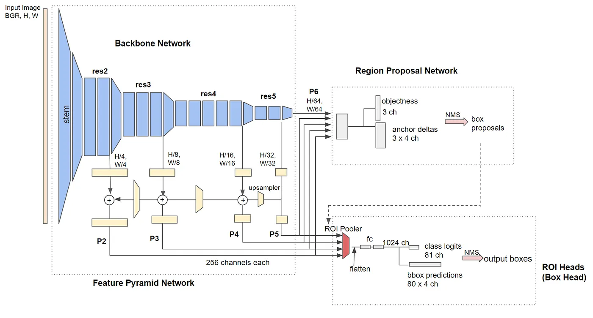
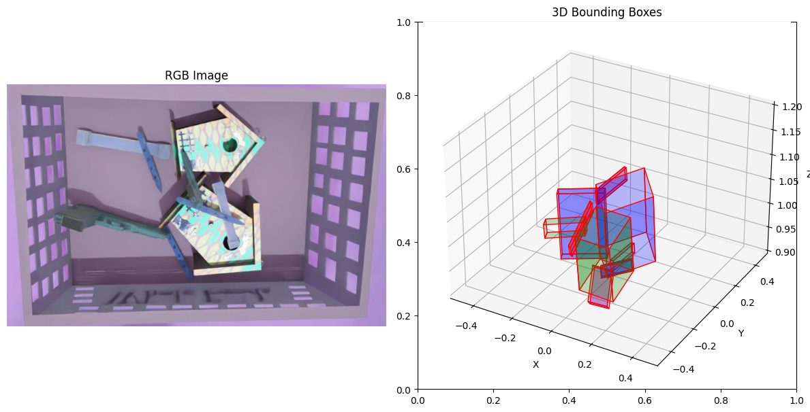
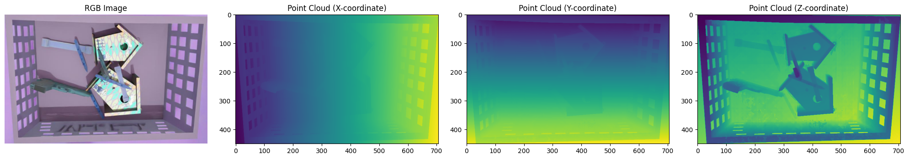
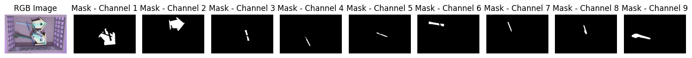
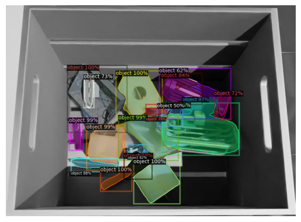

# instance-segmentation-challenge

**Author**: Vojtěch Sýkora  
**Date**: October 2024  

## Model: Detectron2

[Detectron2](https://github.com/facebookresearch/detectron2?source=post_page-----47b2e794fabd--------------------------------) is a next-generation open-source object detection system from Facebook AI Research. It is based on [maskrcnn-benchmark](https://github.com/facebookresearch/maskrcnn-benchmark). I chose this model based on its appropriate architecture for the given task of instance segmentation and the availability of resources about it. The loss came from the default configuration of the model taken from the zoo of the original repo. The model and configuration were from the [model zoo](https://github.com/facebookresearch/detectron2/blob/main/MODEL_ZOO.md)  (with a size of 44 million parameters), loaded from this file:  
`COCO-InstanceSegmentation/mask_rcnn_R_50_FPN_3x.yaml`

### Loss

The loss function was the Smooth L1 Loss. In object detection and segmentation tasks, such as with bounding box predictions, large outliers can occur, and Smooth L1 Loss provides a balanced approach. It’s less sensitive to these outliers than L2 loss while still penalizing errors effectively, making it especially suitable for tasks with both small and large errors.

## Setup
Python 3.10.10 was used and libraries specified in requirements.txt

Once the dataset was downloaded I ran `dataset_utils.py` which copies the dl_challenge directory into dl_challenge_copy while splitting into train, validation, and test sets. The source and destination directories can be adjusted as well as the sizes of splits. 

Then I did some basic dataset exploration in `dataset_exploration.ipynb` to understand the files that were given.

Following that the main pipeline is in `main.ipynb`

## Dataset

### 3D Bounding Boxes

The dataset includes 3D bounding boxes for each object instance. These bounding boxes are crucial for understanding the spatial dimensions and positions of objects within the scene. Below is an illustration of the 3D bounding boxes used in this project:

### 3D Point Cloud

The dataset also includes 3D point clouds, which provide a detailed representation of the object's surface geometry. These point clouds are essential for tasks that require precise spatial information. Below is an illustration of the 3D point clouds used in this project:

### 2D Masks

The dataset also includes 2D masks for each object instance. These masks are used to identify the exact pixels that belong to each object, which is crucial for precise segmentation tasks. Below is an illustration of the 2D masks used in this project:

## Results

Segmentation Results (segm):
- Average Precision (AP): 46.10
- Average Precision at IoU=0.50 (AP50): 59.89
- Average Precision at IoU=0.75 (AP75): 50.52
- Average Precision for small objects (APs): 9.97
- Average Precision for medium objects (APm): 46.53
- Average Precision for large objects (APl): 82.40

